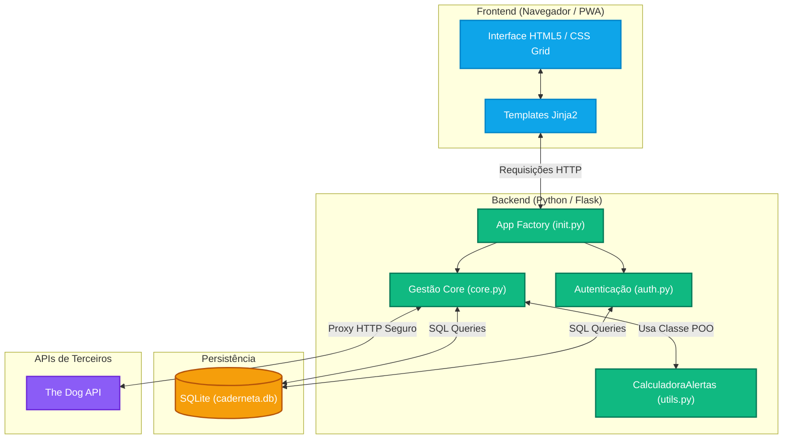

# Relatório de Processo - Projeto Integrador: Caderneta PET

## 1. Fontes e Ferramentas Extra-aula Utilizadas

Durante o desenvolvimento da Caderneta PET, recorri a algumas ferramentas externas para garantir a qualidade profissional e o cumprimento dos requisitos técnicos:

* **Mermaid Live Editor:** Utilizado para desenhar e exportar o Diagrama de Arquitetura do sistema sem a necessidade de softwares pesados de design.
* **Google Fonts:** Importação da tipografia *Nunito* para melhorar a legibilidade e a interface de utilizador (UI).
* **The Dog API:** Documentação oficial consultada para a integração via requisição assíncrona (AJAX/Fetch) no formulário de criação de pets, garantindo a listagem dinâmica de raças.
* **Inteligência Artificial (Gemini):** Utilizada como "Thought Partner" (Parceiro de Pensamento) e assistente de *pair programming*. A IA auxiliou na refatoração de código repetitivo, na formatação do CSS Grid visando os padrões de Acessibilidade (WCAG) e na construção das expressões regulares e lógica de datas encapsulada na classe Orientada a Objetos (`CalculadoraAlertas`).

### Arquitetura do Sistema

Abaixo apresentamos o diagrama da arquitetura MVC adaptada que utilizamos na aplicação, evidenciando a separação entre Frontend, Backend e Banco de Dados:

## Dificuldades Encontradas e Soluções

O maior desafio técnico ocorreu na integração entre o Backend e a Persistência de Dados. Ao evoluir o projeto para incluir os campos "Peso" e "Microchip", o sistema começou a retornar *Erros 500 (Internal Server Error)* e `sqlite3.OperationalError: no such column`.

**Como foi superado:** Percebemos que o esquema lógico do banco de dados (o ficheiro `schema.sql`) estava dessincronizado com os formulários HTML e as rotas Flask. Para resolver, refatorei o `schema.sql` padronizando os nomes das colunas, adicionei a instrução `ON DELETE CASCADE` para evitar registos órfãos ao excluir um pet, apaguei o ficheiro físico antigo (`caderneta.db`) e forcei o sistema a recriar a estrutura do zero através do padrão *App Factory*. Além disso, enfrentei falsos-positivos de CSS no VS Code devido à sintaxe do Jinja2 no HTML, o que foi resolvido separando a lógica visual em blocos `<style>` e classes dinâmicas.

## Autoavaliação

* **O que foi compreendido bem:** Sinto muita segurança no fluxo MVC (Model-View-Controller) adaptado pelo Flask. A criação de *Blueprints* (`auth.py` e `core.py`), a gestão de sessões globais de utilizadores (`g.tutor`) e a injeção de dados no frontend usando *Jinja2* tornaram-se processos muito naturais. O desenvolvimento do *CSS Grid* aliado à responsividade (Media Queries) também foi um ponto alto do meu aprendizado.
* **O que ainda preciso melhorar:** O gerenciamento de migrações de banco de dados. Apagar o ficheiro `.db` e recriá-lo é viável em ambiente de desenvolvimento, mas entendo que para aplicações reais em produção precisarei de dominar ferramentas como o *Alembic* ou o *Flask-Migrate* para atualizar tabelas sem perder os dados dos utilizadores.

## Sugestões e Avaliação do Curso

O formato orientado a projeto foi excelente por forçar a resolução de problemas reais (como o CORS e o bloqueio de requisições a APIs externas em navegadores, que resolvemos criando um Proxy HTTP no Backend). Como sugestão de melhoria para as próximas edições do curso, seria interessante a inclusão de um módulo curto focado especificamente em "Migrações de Banco de Dados", preparando os alunos para cenários onde a exclusão da base de testes não seja uma opção.
