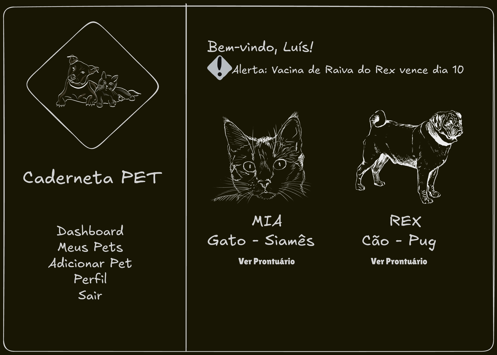
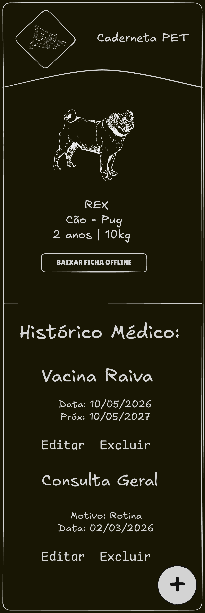

# Pré-projeto: Caderneta Pet (Prontuário Digital)

## 1. Identificação da Equipe

**Nome do projeto:** Caderneta Pet (nome provisório)

**Equipe:**
* **[Pietro Veloso Rosa]** (GitHub: [@pietropvr]) - Foco em Módulo de Tutores, Autenticação e Gestão de Pets (Banco, Rotas Flask, Tela JS).
* **[Jéssica Vitória Almeida da Silva]** (GitHub: [@jwssic]) - Foco em Módulo de Histórico Médico, Exportação Standalone HTML e Testes.

> *Nota: A divisão é por fatias verticais, ou seja, ambos desenvolverão frontend e backend em suas respectivas funcionalidades para garantir aprendizado integral e colaboração via Pull Requests.*

---

## 2. Elevator Pitch

> "Para donos de animais de estimação que têm dificuldade em organizar o histórico de saúde de seus pets, o Caderneta Pet é uma aplicação web que centraliza vacinas, consultas e documentos médicos. Diferente de cadernetas de papel que se perdem ou planilhas confusas, nós oferecemos um prontuário digital seguro com exportação offline, garantindo que a informação vital do pet esteja sempre disponível na palma da mão durante qualquer emergência veterinária."

---

## 3. Público-Alvo e Contexto

* **Quem vai usar?** Tutores de animais de estimação (cães e gatos) e protetores independentes.
* **Em que situação?** No computador de casa para cadastrar um histórico longo, ou no celular (sala de espera do veterinário) para consultar a data da última vacina ou vermífugo.
* **Por que isso é melhor?** O papel rasga ou é esquecido; o WhatsApp desorganiza a informação. Nossa aplicação centraliza tudo, permite buscas rápidas e gera um relatório offline para áreas sem sinal de internet.

---

## 4. Funcionalidades Principais (Alinhadas aos Requisitos)

* **Gestão de Pets com API Externa:** Como tutor, quero cadastrar, editar e remover meus pets. No cadastro, um campo de busca consumirá a The Dog/Cat API de forma assíncrona usando fetch() no frontend com JavaScript Vanilla para sugerir e autocompletar a raça. Haverá um botão "SRD (Sem Raça Definida)" para desabilitar a busca.
* **Prontuário Médico (Chaves Estrangeiras):** Como tutor, quero adicionar, listar e editar registros médicos (tipo, data do evento, próxima dose, descrição, veterinário) atrelados ao perfil do pet, para manter o histórico atualizado.
* **Dashboard de Alertas (Classe Python):** Como tutor, ao fazer login, quero visualizar um painel resumo. O backend utilizará uma Classe Python dedicada (ex: GerenciadorSaude) contendo a lógica de negócio para calcular quais pets possuem vacinas ou procedimentos próximos do vencimento nos próximos 30 dias.
* **Busca e Filtros no Frontend:** Como tutor, quero poder filtrar rapidamente o histórico do meu pet na tela usando manipulação de DOM com JS Vanilla, sem precisar recarregar a página.
* **Exportação Standalone (Offline):** Como tutor, quero exportar a ficha do pet como um arquivo .html único (com CSS embutido gerado via Jinja2), contendo dados vitais e contatos, para abrir no celular totalmente sem internet em caso de emergência.

---

## 5. Escopo Negativo — O que NÃO faremos

* Não teremos integração direta, perfis ou login para clínicas veterinárias (uso exclusivo B2C do tutor).
* Não será um aplicativo mobile nativo (será uma aplicação web responsiva para o navegador usando CSS Grid).
* Não teremos envio automático de notificações por e-mail, SMS ou WhatsApp (o usuário precisará logar para ver os avisos no Dashboard).
* Não haverá módulo de controle financeiro de gastos com o animal.

---

## 6. Modelo de Dados Preliminar

O sistema utilizará um banco de dados relacional com as seguintes tabelas principais:

* **TUTOR:** id (PK), nome, email (Unique), senha_hash.
* **PET:** id (PK), tutor_id (FK), nome, especie (Cão/Gato), raca, data_nascimento, peso_atual_kg.
* **REGISTRO_MEDICO:** id (PK), pet_id (FK), tipo_registro (Vacina/Consulta/Vermífugo), nome_evento, data_evento, data_proxima_dose (Opcional), nome_veterinario, observacoes.

**Relacionamentos:** Um TUTOR possui N PETS. Um PET possui N REGISTROS_MEDICOS.

---

## 7. Wireframes (Estrutura)

### Tela de Computador (Dashboard):

*Wireframe mostrando um menu lateral fixo usando CSS Grid e a lista de pets em formato de cartões na área principal.*

### Tela de Celular (Detalhe do Pet):

*Wireframe mostrando os cartões empilhados em uma coluna única (Media Queries) para leitura responsiva, com botão flutuante de "Adicionar Registro".*

---

## 8. Stack Confirmado e Ferramentas

* **Backend:** Python 3 + Flask.
* **Templates:** Jinja2.
* **Banco de Dados:** SQLite (Ideal para este escopo acadêmico, não exige container/servidor externo).
* **Frontend:** HTML5 Semântico, CSS Grid, JavaScript Vanilla.
* **Controle de Versão:** Git + GitHub (Repositório público com colaboração via Pull Requests).
* **Bibliotecas de apoio:**
  * **python-dotenv:** Para gerenciar variáveis de ambiente de forma segura.
  * **pytest:** Para testes unitários da classe de regras de negócio (GerenciadorSaude).
  * **werkzeug.security:** Para geração de hash de senhas no banco.

---

## 9. Autoavaliação de Riscos

* **Risco Técnico Principal:** A geração do arquivo standalone HTML/JS exige embutir informações dinâmicas diretamente nas tags `<style>` e `<script>` via Jinja2, sem quebrar a sintaxe. 
  * **Mitigação:** Criaremos um template específico e isolado só para isso, testando sua renderização desde a primeira semana.
* **O "Caminho Feliz" Mínimo (Plano de Contingência):** Caso ocorram atrasos severos, a aplicação entregará valor permitindo criar uma conta, cadastrar um pet, inserir um registro de vacina no banco de dados SQLite e exibi-lo na tela.
* **Gestão da Dupla:** Como faremos Pull Requests constantes, se um membro ficar indisponível perto da entrega, o outro terá total conhecimento da base de código para garantir o "caminho feliz" mínimo exigido.